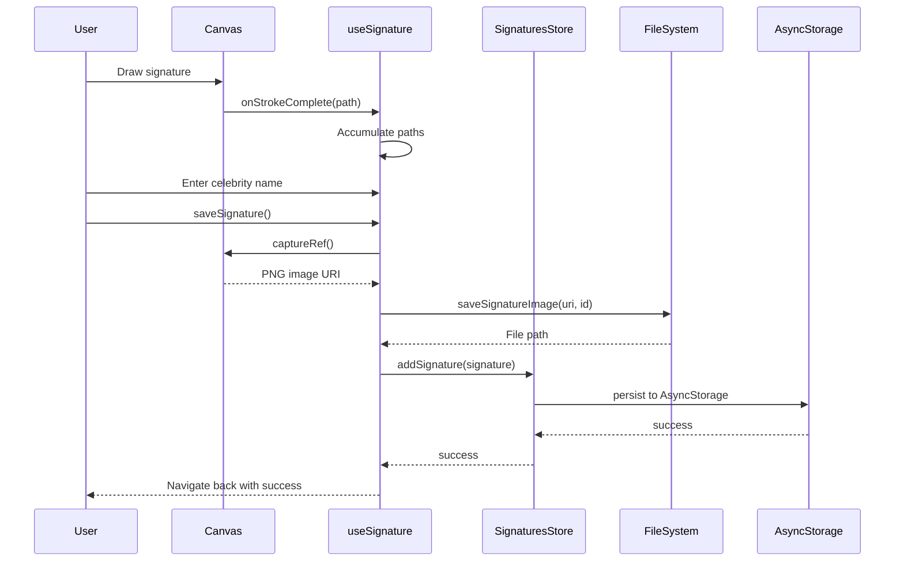
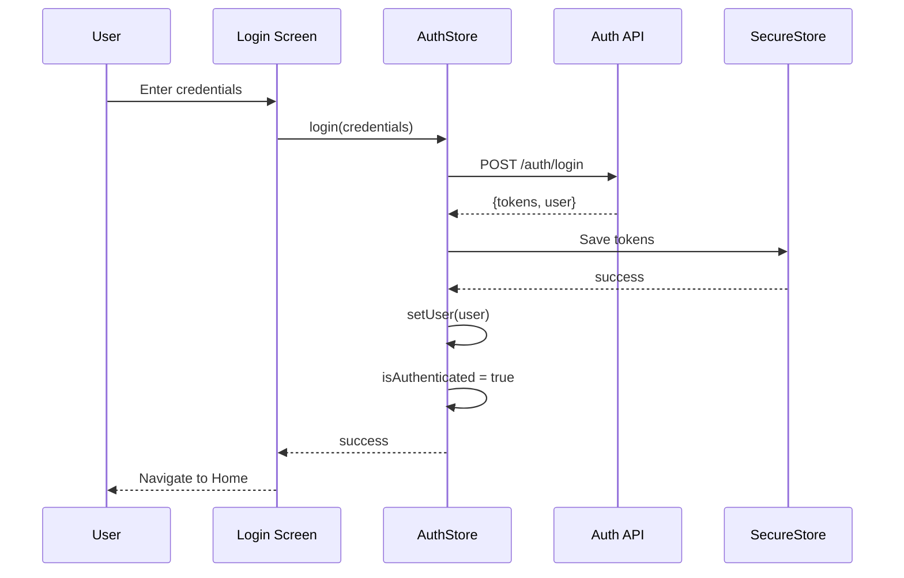
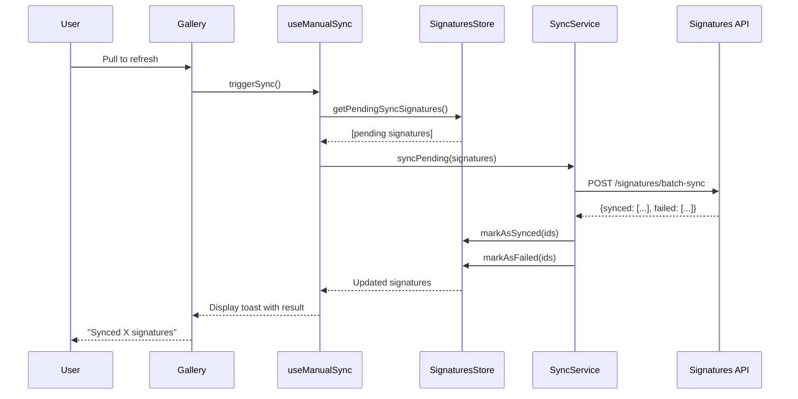

# Architecture Overview - Signature App

This document provides visual architecture diagrams and detailed system design documentation.

## System Architecture

### Application Layers

```
┌─────────────────────────────────────────────────────────────────────┐
│                          User Interface Layer                        │
│  ┌──────────────┐  ┌──────────────┐  ┌──────────────┐               │
│  │  Onboarding  │  │     Tabs     │  │  Auth/Login  │               │
│  │   Screen     │  │  Navigator   │  │   Screens    │               │
│  └──────────────┘  └──────────────┘  └──────────────┘               │
│         │                  │                 │                        │
│         └──────────────────┴─────────────────┘                       │
│                            │                                          │
│                  ┌─────────▼─────────┐                               │
│                  │  Expo Router       │                               │
│                  │  (File-based Nav)  │                               │
│                  └─────────┬─────────┘                               │
└────────────────────────────┼──────────────────────────────────────────┘
                             │
┌────────────────────────────▼──────────────────────────────────────────┐
│                        Component Layer                                │
│  ┌──────────┐  ┌──────────┐  ┌──────────┐  ┌──────────┐             │
│  │Signature │  │Wallpaper │  │ Premium  │  │   UI     │             │
│  │Components│  │Components│  │Components│  │Components│             │
│  └─────┬────┘  └─────┬────┘  └─────┬────┘  └─────┬────┘             │
│        └────────────┬┴──────────────┴─────────────┘                  │
└─────────────────────┼──────────────────────────────────────────────────┘
                      │
┌─────────────────────▼──────────────────────────────────────────────────┐
│                      Business Logic Layer                              │
│  ┌──────────────┐  ┌──────────────┐  ┌──────────────┐                │
│  │useSignature  │  │useWallpaper  │  │useAnalytics  │                │
│  │    Hook      │  │    Hook      │  │    Hook      │                │
│  └──────┬───────┘  └──────┬───────┘  └──────┬───────┘                │
│         └──────────────────┴──────────────────┘                       │
│                            │                                           │
└────────────────────────────┼───────────────────────────────────────────┘
                             │
┌────────────────────────────▼───────────────────────────────────────────┐
│                      State Management Layer                            │
│  ┌─────────────────┐  ┌─────────────────┐  ┌─────────────────┐       │
│  │  Signatures     │  │   Auth Store    │  │  Premium Store  │       │
│  │     Store       │  │    (Zustand)    │  │    (Zustand)    │       │
│  │   (Zustand)     │  └─────────────────┘  └─────────────────┘       │
│  └─────────────────┘                                                  │
└────────────────────────────┬───────────────────────────────────────────┘
                             │
┌────────────────────────────▼───────────────────────────────────────────┐
│                         Service Layer                                  │
│  ┌──────────┐  ┌──────────┐  ┌──────────┐  ┌──────────┐              │
│  │   API    │  │ Storage  │  │Analytics │  │   Sync   │              │
│  │ Services │  │ Services │  │ Services │  │ Services │              │
│  └─────┬────┘  └─────┬────┘  └─────┬────┘  └─────┬────┘              │
│        │             │              │             │                   │
└────────┼─────────────┼──────────────┼─────────────┼────────────────────┘
         │             │              │             │
┌────────▼─────────────▼──────────────▼─────────────▼────────────────────┐
│                      External Dependencies                             │
│  ┌──────────┐  ┌──────────┐  ┌──────────┐  ┌──────────┐              │
│  │   REST   │  │  Device  │  │Amplitude │  │Cloud API │              │
│  │   API    │  │ Storage  │  │ Sentry   │  │  Sync    │              │
│  └──────────┘  └──────────┘  └──────────┘  └──────────┘              │
└────────────────────────────────────────────────────────────────────────┘
```

## Data Flow Architecture

### Signature Capture Data Flow



### Authentication Flow



### Cloud Sync Flow



## State Management Architecture

### Zustand Store Pattern

```
┌─────────────────────────────────────────────────┐
│            SignaturesStore (Zustand)            │
├─────────────────────────────────────────────────┤
│  State:                                         │
│    - signatures: Signature[]                    │
│    - isLoading: boolean                         │
│    - error: string | null                       │
├─────────────────────────────────────────────────┤
│  Actions:                                       │
│    - loadSignatures()                           │
│    - addSignature(signature)                    │
│    - updateSignature(id, updates)               │
│    - removeSignature(id) // Soft delete         │
│    - getById(id)                                │
│    - getActiveSignatures()                      │
│    - getSortedSignatures(sortBy)                │
│    - markAsSynced(id, cloudUrl)                 │
│    - markAsSyncFailed(id)                       │
│    - getPendingSyncSignatures()                 │
├─────────────────────────────────────────────────┤
│  Persistence:                                   │
│    AsyncStorage: @signature_app/signatures      │
└─────────────────────────────────────────────────┘
                     │
                     │ Subscribed by
                     ▼
    ┌────────────────────────────────┐
    │  Components & Hooks            │
    │  - Home Screen                 │
    │  - Gallery Screen              │
    │  - useSignature Hook           │
    │  - useManualSync Hook          │
    └────────────────────────────────┘
```

### Store Relationships

```
┌─────────────────┐
│   Auth Store    │
│                 │
│  - user         │────┐
│  - isAuth       │    │
│  - token        │    │
└─────────────────┘    │
                       │
                       │ User context
                       ▼
              ┌─────────────────┐
              │ Signatures      │
              │    Store        │
              │                 │
              │  - userId       │
              │  - signatures   │
              └─────────────────┘
                       │
                       │ Premium features
                       ▼
              ┌─────────────────┐
              │  Premium Store  │
              │                 │
              │  - isPremium    │
              │  - subscription │
              └─────────────────┘
```

## Component Architecture

### Component Hierarchy

```
App Root (_layout.tsx)
├── ThemeProvider
│   └── ErrorBoundary
│       └── QueryClientProvider
│           └── AnalyticsProvider
│               └── Stack Navigator
│                   ├── index (Route Handler)
│                   ├── onboarding
│                   ├── (auth) Group
│                   │   ├── login
│                   │   ├── register
│                   │   └── forgot-password
│                   ├── (tabs) Group
│                   │   ├── _layout (Tab Navigator)
│                   │   ├── index (Home)
│                   │   └── gallery
│                   ├── signature-canvas
│                   ├── signature-detail
│                   ├── wallpaper-editor
│                   └── premium
```

### Reusable Component Structure

```
src/components/
├── ui/                    # Base components (no business logic)
│   ├── Button
│   ├── Input
│   ├── Card
│   ├── Modal
│   └── Toast
│
├── shared/                # Shared composite components
│   ├── Header
│   ├── EmptyState
│   └── LoadingSpinner
│
├── signature/             # Feature-specific (signature)
│   ├── SignatureCanvas   (uses Skia)
│   ├── ColorPicker
│   └── SignatureCard
│
├── wallpaper/             # Feature-specific (wallpaper)
│   ├── TemplateCarousel
│   ├── TemplateRenderer
│   └── WallpaperPreview
│
├── premium/               # Feature-specific (premium)
│   ├── PaywallModal
│   ├── PremiumBadge
│   └── SubscriptionCard
│
├── analytics/             # Cross-cutting (analytics)
│   ├── AnalyticsProvider
│   └── ScreenTracker
│
└── error/                 # Cross-cutting (errors)
    └── ErrorBoundary
```

## Service Layer Architecture

### API Client Architecture

```
┌─────────────────────────────────────────────────┐
│              ApiClient (client.ts)              │
├─────────────────────────────────────────────────┤
│  Base HTTP Client                               │
│  - Token injection from SecureStore             │
│  - JSON serialization                           │
│  - Error handling                               │
│  - Retry logic                                  │
├─────────────────────────────────────────────────┤
│  Methods:                                       │
│    request<T>(endpoint, options)                │
│    get<T>(endpoint)                             │
│    post<T>(endpoint, body)                      │
│    put<T>(endpoint, body)                       │
│    delete<T>(endpoint)                          │
└─────────────────────────────────────────────────┘
                     │
         ┌───────────┴───────────┬───────────┐
         │                       │           │
         ▼                       ▼           ▼
┌─────────────────┐  ┌──────────────────┐  ┌──────────────────┐
│  Auth Service   │  │Signatures Service│  │Subscriptions Svc │
│  (auth.ts)      │  │ (signatures.ts)  │  │(subscriptions.ts)│
├─────────────────┤  ├──────────────────┤  ├──────────────────┤
│ - login()       │  │ - getAll()       │  │ - getStatus()    │
│ - register()    │  │ - getById()      │  │ - checkout()     │
│ - loginGoogle() │  │ - create()       │  │ - cancel()       │
│ - loginApple()  │  │ - update()       │  │ - getPlans()     │
│ - logout()      │  │ - delete()       │  └──────────────────┘
│ - getCurrentUser│  │ - batchSync()    │
└─────────────────┘  └──────────────────┘
```

### Storage Service Architecture

```
┌────────────────────────────────────────────────┐
│           Storage Abstraction Layer            │
├────────────────────────────────────────────────┤
│                                                │
│  ┌──────────────────┐  ┌──────────────────┐   │
│  │  AsyncStorage    │  │  SecureStore     │   │
│  │  (async-storage) │  │ (secure-storage) │   │
│  ├──────────────────┤  ├──────────────────┤   │
│  │ - get<T>(key)    │  │ - get(key)       │   │
│  │ - set<T>(key,val)│  │ - set(key, val)  │   │
│  │ - remove(key)    │  │ - remove(key)    │   │
│  │ - clear()        │  └──────────────────┘   │
│  └──────────────────┘                          │
│                                                │
│  ┌──────────────────────────────────────────┐ │
│  │       FileSystem (file-system.ts)        │ │
│  ├──────────────────────────────────────────┤ │
│  │ - init()                                 │ │
│  │ - saveSignatureImage(uri, id)            │ │
│  │ - getSignatureImage(id)                  │ │
│  │ - deleteSignatureImage(id)               │ │
│  │ - getSignatureDirectory()                │ │
│  └──────────────────────────────────────────┘ │
└────────────────────────────────────────────────┘
```

### Analytics Service Architecture

```
┌────────────────────────────────────────────────┐
│      AnalyticsTracker (tracker.ts)             │
├────────────────────────────────────────────────┤
│  Unified Analytics Interface                   │
│  - initialize()                                │
│  - trackScreen(name)                           │
│  - trackEvent(name, properties)                │
│  - identifyUser(id, traits)                    │
│  - setUserProperty(key, value)                 │
└────────────────────────────────────────────────┘
                     │
         ┌───────────┴───────────┐
         │                       │
         ▼                       ▼
┌─────────────────┐    ┌─────────────────┐
│    Amplitude    │    │     Sentry      │
│  (amplitude.ts) │    │   (sentry.ts)   │
├─────────────────┤    ├─────────────────┤
│ Product         │    │ Error Tracking  │
│ Analytics       │    │ Crash Reports   │
│ - Events        │    │ Performance     │
│ - Funnels       │    │ Breadcrumbs     │
│ - User Traits   │    │ Releases        │
└─────────────────┘    └─────────────────┘
```

## File System Structure

### App Data Storage

```
iOS: /Documents/
Android: /data/data/{package}/files/

AppDataDirectory/
├── signatures/               # Signature images
│   ├── sig_1699012345_abc123.png
│   ├── sig_1699012456_def456.png
│   └── ...
│
├── wallpapers/              # Generated wallpapers (cached)
│   ├── wall_1699012789_xyz.png
│   └── ...
│
└── temp/                    # Temporary files
    └── ...
```

### AsyncStorage Data

```
Keys:
  @signature_app/auth_token        → SecureStore (encrypted)
  @signature_app/refresh_token     → SecureStore (encrypted)
  @signature_app/user_data         → AsyncStorage (JSON)
  @signature_app/onboarding_completed → AsyncStorage (boolean)
  @signature_app/signatures        → AsyncStorage (JSON array)
  @signature_app/sync_queue        → AsyncStorage (JSON array)
  @signature_app/analytics_consent → AsyncStorage (boolean)
  @signature_app/last_sync         → AsyncStorage (ISO date string)
```

## Performance Considerations

### Optimization Strategies

1. **List Rendering**:
   - Use `@shopify/flash-list` for signature gallery (2-column grid)
   - Virtualized rendering for 1000+ items
   - Item height estimation for smooth scrolling

2. **Canvas Performance**:
   - Skia hardware acceleration
   - 60fps target for path rendering
   - Debounced save operations

3. **Image Handling**:
   - PNG compression with 0.9 quality
   - Lazy loading of signature thumbnails
   - Resolution-based rendering (standard vs HD)

4. **State Management**:
   - Zustand: Minimal re-renders
   - Selective store subscriptions
   - Memoized selectors

5. **Navigation**:
   - Expo Router: File-based routing with code splitting
   - Lazy screen loading
   - Navigation state persistence

### Bundle Size

- **Initial Bundle**: ~15MB (with Skia)
- **Code Splitting**: Screens loaded on-demand
- **Asset Optimization**: SVG over PNG where possible

### Memory Management

- **Image Caching**: Limited cache size (50 recent)
- **Canvas Cleanup**: Release Skia resources on unmount
- **Store Cleanup**: Clear on logout

## Security Architecture

### Data Protection

```
┌─────────────────────────────────────────────────┐
│              Security Layers                    │
├─────────────────────────────────────────────────┤
│                                                 │
│  1. Transport Security                          │
│     - HTTPS only (TLS 1.2+)                     │
│     - Certificate pinning (production)          │
│                                                 │
│  2. Storage Security                            │
│     - Auth tokens → SecureStore (Keychain)      │
│     - API keys → SecureStore                    │
│     - User data → AsyncStorage (non-sensitive)  │
│                                                 │
│  3. API Security                                │
│     - Bearer token authentication               │
│     - Token refresh mechanism                   │
│     - Request signing (future)                  │
│                                                 │
│  4. App Security                                │
│     - No sensitive data in logs                 │
│     - Screenshot blocking (premium screens)     │
│     - Jailbreak detection (future)              │
│                                                 │
└─────────────────────────────────────────────────┘
```

### Authentication Flow

```
User Login
    │
    ├──> Email/Password
    │       │
    │       ├──> Hash password (client-side salted)
    │       └──> POST /auth/login
    │
    ├──> Google OAuth
    │       │
    │       ├──> Google Sign-In SDK
    │       └──> POST /auth/google with token
    │
    └──> Apple Sign In
            │
            ├──> Apple Auth SDK
            └──> POST /auth/apple with token

                    │
                    ▼
            ┌───────────────┐
            │  API Response │
            │  - access_token
            │  - refresh_token
            │  - user object
            └───────┬───────┘
                    │
                    ▼
            ┌───────────────┐
            │  SecureStore  │
            │  Save tokens  │
            └───────┬───────┘
                    │
                    ▼
            ┌───────────────┐
            │  Auth Store   │
            │  setUser()    │
            │  isAuth=true  │
            └───────────────┘
```

## Error Handling Strategy

### Error Hierarchy

```
┌─────────────────────────────────────────────────┐
│             Error Handling Layers               │
├─────────────────────────────────────────────────┤
│                                                 │
│  1. React Error Boundary                        │
│     - Catches render errors                     │
│     - Logs to Sentry                            │
│     - Shows fallback UI                         │
│     - Provides "Try Again" action               │
│                                                 │
│  2. API Error Handling                          │
│     - Network errors → Retry with exponential   │
│                        backoff                  │
│     - 401 Unauthorized → Refresh token or logout│
│     - 403 Forbidden → Show paywall or error     │
│     - 404 Not Found → User-friendly message     │
│     - 500 Server Error → Log & retry            │
│                                                 │
│  3. Validation Errors                           │
│     - Form validation → Inline error messages   │
│     - Business logic → Toast notification       │
│     - Data integrity → Soft fallback            │
│                                                 │
│  4. Permission Errors                           │
│     - Location denied → Disable location feature│
│     - Camera denied → Show permission modal     │
│     - Storage denied → Alert user               │
│                                                 │
│  5. Unexpected Errors                           │
│     - JavaScript errors → Sentry capture        │
│     - Native crashes → Sentry native SDK        │
│     - Unknown errors → Generic error message    │
│                                                 │
└─────────────────────────────────────────────────┘
```

## Deployment Architecture

### Build & Release Pipeline

```
Development
    │
    ├── Feature Branch
    │       │
    │       ├── Local Development
    │       ├── Lint & Type Check
    │       ├── Unit Tests
    │       └── Create PR
    │
    ├── Pull Request
    │       │
    │       ├── CI Checks (GitHub Actions)
    │       ├── Code Review
    │       └── Merge to Main
    │
    └── Main Branch
            │
            ├── Staging Build (EAS)
            │       │
            │       ├── Internal Testing
            │       └── QA Validation
            │
            └── Production Build (EAS)
                    │
                    ├── App Store Submission
                    └── Play Store Submission
```

### Environment Configuration

```
┌─────────────────────────────────────────────────┐
│              Environment Configs                │
├─────────────────────────────────────────────────┤
│                                                 │
│  Development                                    │
│    - API: http://localhost:3000                 │
│    - Amplitude: dev_key                         │
│    - Sentry: dev_dsn                            │
│    - Debug mode: ON                             │
│                                                 │
│  Staging                                        │
│    - API: https://staging-api.signature-app.com │
│    - Amplitude: staging_key                     │
│    - Sentry: staging_dsn                        │
│    - Debug mode: ON                             │
│                                                 │
│  Production                                     │
│    - API: https://api.signature-app.com         │
│    - Amplitude: prod_key                        │
│    - Sentry: prod_dsn                           │
│    - Debug mode: OFF                            │
│                                                 │
└─────────────────────────────────────────────────┘
```

---

## Scalability Considerations

### Current Scale

- **User Base**: POC (1-100 users)
- **Signatures**: ~10-100 per user
- **Storage**: Local device + cloud backup
- **Performance**: Optimized for single-device usage

### Future Scale (1000+ users)

1. **Backend**:
   - CDN for signature images
   - Database sharding by user
   - Redis caching layer
   - Background job queues

2. **Mobile App**:
   - Pagination for large galleries
   - Incremental sync (delta sync)
   - Local database (SQLite/Realm)
   - Image compression pipeline

3. **Analytics**:
   - Event batching
   - Sampling for high-volume events
   - Distributed tracing

---

**Document Version**: 1.0
**Last Updated**: November 1, 2025
