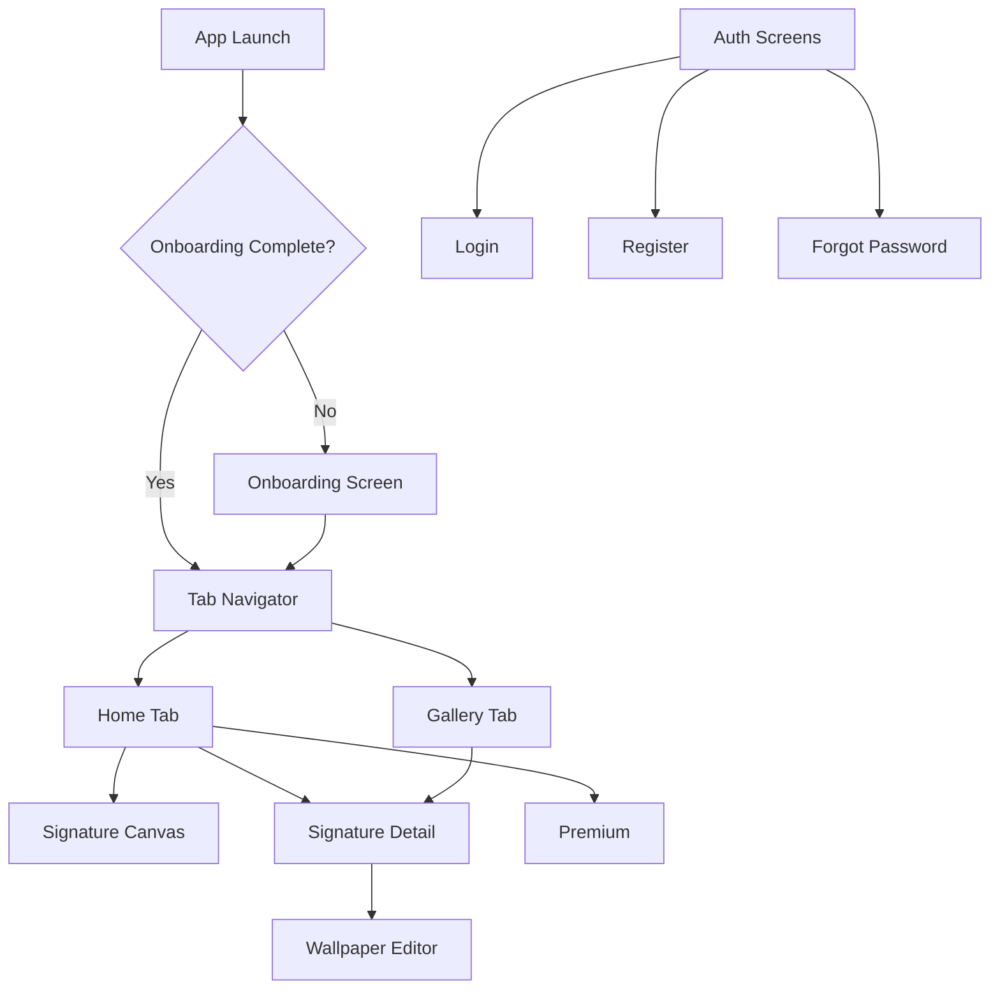

# Technical Documentation - Signature App

> **Version:** 0.1.0
> **Last Updated:** November 1, 2025
> **Technology:** React Native 0.81.5 + Expo SDK 54.0.0

## Table of Contents

1. [Project Overview](#project-overview)
2. [Architecture](#architecture)
3. [Technology Stack](#technology-stack)
4. [Project Structure](#project-structure)
5. [Application Screens](#application-screens)
6. [Components](#components)
7. [State Management](#state-management)
8. [Hooks](#hooks)
9. [Services](#services)
10. [Data Flow](#data-flow)
11. [Type System](#type-system)
12. [Design System](#design-system)
13. [Key Features](#key-features)

---

## Project Overview

The Signature App is a React Native mobile application that allows users to capture, store, and manage digital celebrity signatures. Users can create custom wallpapers from signatures and organize their collection with a premium subscription model.

### Core Capabilities

- Digital signature capture using Skia canvas
- Location-aware signature metadata
- Custom wallpaper generation from signatures
- Cloud synchronization (manual)
- Premium subscription features
- Analytics and error tracking
- GDPR-compliant consent management

---

## Architecture

### High-Level Architecture

```
┌─────────────────────────────────────────────────────────────┐
│                      Presentation Layer                      │
│  (Screens, Components, Navigation via Expo Router)           │
└─────────────────────┬───────────────────────────────────────┘
                      │
┌─────────────────────┴───────────────────────────────────────┐
│                    Business Logic Layer                      │
│  (Custom Hooks: useSignature, useWallpaper, useAnalytics)    │
└─────────────────────┬───────────────────────────────────────┘
                      │
┌─────────────────────┴───────────────────────────────────────┐
│                    State Management Layer                    │
│  (Zustand Stores: signatures, auth, premium)                 │
└─────────────────────┬───────────────────────────────────────┘
                      │
┌─────────────────────┴───────────────────────────────────────┐
│                       Service Layer                          │
│  (API, Storage, Sync, Analytics, File System)                │
└─────────────────────────────────────────────────────────────┘
```

### Architecture Patterns

- **Component-Based UI**: Reusable, composable UI components
- **Custom Hooks Pattern**: Encapsulated business logic in custom hooks
- **Centralized State**: Zustand stores for global state management
- **Service Layer**: Abstracted external dependencies (API, storage, analytics)
- **File-Based Routing**: Expo Router for declarative navigation
- **Design Tokens**: Centralized design system with theme support

---

## Technology Stack

### Core Framework

- **React Native**: 0.81.5
- **React**: 19.1.0
- **Expo SDK**: 54.0.0
- **TypeScript**: 5.9.2

### Key Libraries

| Library | Version | Purpose |
|---------|---------|---------|
| `expo-router` | 6.0.14 | File-based navigation |
| `@shopify/react-native-skia` | 2.2.12 | High-performance canvas rendering |
| `@tanstack/react-query` | 5.90.5 | Server state management |
| `zustand` | 5.0.8 | Client state management |
| `react-native-reanimated` | 4.1.3 | Smooth animations |
| `react-native-gesture-handler` | 2.28.0 | Gesture handling |
| `@shopify/flash-list` | 2.0.2 | Performant lists |
| `react-native-view-shot` | 4.0.3 | Screenshot/capture capability |

### Expo Modules

- `expo-file-system`: File operations
- `expo-location`: GPS location capture
- `expo-media-library`: Photo library access
- `expo-secure-store`: Secure credential storage
- `expo-sharing`: Native sharing functionality

### Development Tools

- **ESLint**: Code linting
- **Prettier**: Code formatting
- **Husky**: Git hooks
- **TypeScript**: Type safety

---

## Project Structure

```
poc-signature/
├── src/
│   ├── app/                    # Expo Router screens (file-based routing)
│   │   ├── (auth)/             # Authentication group
│   │   │   ├── login.tsx
│   │   │   ├── register.tsx
│   │   │   └── forgot-password.tsx
│   │   ├── (tabs)/             # Tab navigation group
│   │   │   ├── _layout.tsx     # Tab navigator config
│   │   │   ├── index.tsx       # Home screen
│   │   │   └── gallery.tsx     # Gallery screen
│   │   ├── _layout.tsx         # Root layout with providers
│   │   ├── index.tsx           # Entry point / route handler
│   │   ├── onboarding.tsx      # Onboarding carousel
│   │   ├── signature-canvas.tsx # Signature capture
│   │   ├── signature-detail.tsx # Signature details
│   │   ├── wallpaper-editor.tsx # Wallpaper customization
│   │   ├── premium.tsx         # Premium subscription
│   │   └── theme-sandbox.tsx   # Design system preview
│   │
│   ├── components/             # Reusable UI components
│   │   ├── analytics/          # Analytics wrappers
│   │   │   ├── AnalyticsProvider.tsx
│   │   │   └── ScreenTracker.tsx
│   │   ├── error/              # Error handling
│   │   │   └── ErrorBoundary.tsx
│   │   ├── gdpr/               # GDPR compliance
│   │   │   └── ConsentModal.tsx
│   │   ├── onboarding/         # Onboarding components
│   │   │   ├── OnboardingSlide.tsx
│   │   │   ├── OnboardingIllustrations.tsx
│   │   │   └── PaginationDots.tsx
│   │   ├── premium/            # Premium features
│   │   │   ├── PaywallModal.tsx
│   │   │   ├── PremiumBadge.tsx
│   │   │   └── SubscriptionCard.tsx
│   │   ├── shared/             # Shared components
│   │   │   ├── EmptyState.tsx
│   │   │   ├── Header.tsx
│   │   │   ├── LoadingSpinner.tsx
│   │   │   └── PullToRefresh.tsx
│   │   ├── signature/          # Signature-specific
│   │   │   ├── ColorPicker.tsx
│   │   │   ├── SignatureCanvas.tsx
│   │   │   └── SignatureCard.tsx
│   │   ├── ui/                 # Base UI components
│   │   │   ├── Button.tsx
│   │   │   ├── Card.tsx
│   │   │   ├── Input.tsx
│   │   │   ├── Modal.tsx
│   │   │   ├── SyncStatusBadge.tsx
│   │   │   └── Toast.tsx
│   │   └── wallpaper/          # Wallpaper generation
│   │       ├── TemplateCarousel.tsx
│   │       ├── TemplateRenderer.tsx
│   │       └── WallpaperPreview.tsx
│   │
│   ├── hooks/                  # Custom React hooks
│   │   ├── useAnalytics.ts     # Analytics tracking
│   │   ├── useLocation.ts      # GPS location
│   │   ├── useManualSync.ts    # Manual sync trigger
│   │   ├── useSignature.ts     # Signature capture logic
│   │   └── useWallpaper.ts     # Wallpaper generation
│   │
│   ├── services/               # External service integrations
│   │   ├── analytics/          # Analytics services
│   │   │   ├── amplitude.ts
│   │   │   ├── sentry.ts
│   │   │   └── tracker.ts
│   │   ├── api/                # API clients
│   │   │   ├── auth.ts
│   │   │   ├── client.ts
│   │   │   ├── signatures.ts
│   │   │   └── subscriptions.ts
│   │   ├── sharing/            # Share functionality
│   │   │   └── share-service.ts
│   │   ├── storage/            # Storage abstractions
│   │   │   ├── async-storage.ts
│   │   │   ├── file-system.ts
│   │   │   └── secure-storage.ts
│   │   └── sync/               # Cloud sync
│   │       └── signature-sync.ts
│   │
│   ├── store/                  # Zustand state stores
│   │   ├── auth-store.ts       # Authentication state
│   │   ├── premium-store.ts    # Premium subscription state
│   │   └── signatures-store.ts # Signatures collection state
│   │
│   ├── theme/                  # Design system
│   │   ├── index.ts
│   │   ├── tokens.ts           # Design tokens
│   │   └── ThemeProvider.tsx   # Theme context
│   │
│   ├── types/                  # TypeScript type definitions
│   │   ├── analytics.types.ts
│   │   ├── api.types.ts
│   │   ├── auth.types.ts
│   │   ├── signature.types.ts
│   │   ├── subscription.types.ts
│   │   ├── sync.types.ts
│   │   ├── template.types.ts
│   │   └── wallpaper.types.ts
│   │
│   ├── constants/              # App constants
│   │   ├── analytics-events.ts
│   │   ├── colors.ts
│   │   ├── constants.ts
│   │   ├── spacing.ts
│   │   ├── templates.ts
│   │   └── typography.ts
│   │
│   └── utils/                  # Utility functions
│       ├── formatters.ts
│       ├── permissions.ts
│       ├── soft-delete.ts
│       └── validators.ts
│
├── docs/                       # Documentation
├── scripts/                    # Build/setup scripts
├── App.tsx                     # Legacy entry (not used with Expo Router)
├── app.json                    # Expo config
├── package.json                # Dependencies
└── tsconfig.json               # TypeScript config
```

---

## Application Screens

### Navigation Flow



### Screen Reference

#### 1. **Entry Point** (`src/app/index.tsx`)

- **Purpose**: Initial route handler and redirect logic
- **Responsibility**:
  - Check if onboarding is completed
  - Redirect to `/onboarding` or `/(tabs)`
- **Key Dependencies**: `asyncStorage`, `expo-router`

#### 2. **Onboarding Screen** (`src/app/onboarding.tsx`)

- **Purpose**: 3-slide introduction carousel
- **Features**:
  - Horizontal scrollable slides
  - Pagination dots with animation
  - Skip button
  - "Get Started" CTA on final slide
- **Slides**:
  1. Capture Celebrity Signatures
  2. Create Custom Wallpapers
  3. Build Your Collection
- **Navigation**: Redirects to `/(tabs)` on completion

#### 3. **Tab Navigator** (`src/app/(tabs)/_layout.tsx`)

- **Purpose**: Bottom tab navigation configuration
- **Tabs**:
  - **Home** (`index.tsx`): Main screen with CTA and recent signatures
  - **Gallery** (`gallery.tsx`): Grid view of all signatures
- **Styling**: Theme-aware with design tokens

#### 4. **Home Screen** (`src/app/(tabs)/index.tsx`)

- **Purpose**: Main landing page for authenticated users
- **Features**:
  - "New Signature" CTA button
  - Statistics card (signature count)
  - Recent signatures preview (3 most recent)
  - Quick actions section
- **Navigation Targets**:
  - `/signature-canvas` (new signature)
  - `/(tabs)/gallery` (view all)
  - `/signature-detail` (individual signature)

#### 5. **Gallery Screen** (`src/app/(tabs)/gallery.tsx`)

- **Purpose**: Browse and manage signature collection
- **Features**:
  - 2-column grid layout with `FlashList`
  - Sort options: Recent, Oldest, A-Z, Z-A
  - Pull-to-refresh
  - Empty state with CTA
  - Tap signature to view details
- **Performance**: Uses `@shopify/flash-list` for optimized rendering

#### 6. **Signature Canvas Screen** (`src/app/signature-canvas.tsx`)

- **Purpose**: Capture new celebrity signature
- **Features**:
  - Skia-based drawing canvas
  - Color picker (Black, Blue, Red, White)
  - Celebrity name input (required)
  - Location capture toggle
  - Clear canvas button
  - Form validation
  - Save with loading state
- **Canvas Technology**: `@shopify/react-native-skia`
- **Capture Method**: `react-native-view-shot` for image export
- **Navigation**: Back to previous screen on save

#### 7. **Signature Detail Screen** (`src/app/signature-detail.tsx`)

- **Purpose**: View and manage individual signature
- **Features**:
  - Full signature image display
  - Celebrity name and metadata
  - Capture date and location (if available)
  - Sync status indicator
  - Edit/Delete actions
  - "Create Wallpaper" CTA
- **Navigation**: Can navigate to `/wallpaper-editor`

#### 8. **Wallpaper Editor** (`src/app/wallpaper-editor.tsx`)

- **Purpose**: Generate custom phone wallpaper from signature
- **Presentation**: Modal screen
- **Features**:
  - Template selection carousel
  - Background color customization
  - Text color customization
  - Show/hide date toggle
  - Show/hide location toggle
  - Live preview
  - Save to gallery
  - Set as wallpaper (via share sheet)
  - Premium resolution options
- **Templates**: Minimal White, Minimal Black, Gradient, etc.

#### 9. **Premium Screen** (`src/app/premium.tsx`)

- **Purpose**: Subscription purchase and management
- **Features**:
  - Premium benefits display
  - Subscription plans (Monthly/Annual)
  - Trial offer
  - Purchase flow (mock in POC)
  - Manage subscription (cancel)
- **Gating**: Used for paywall enforcement

#### 10. **Theme Sandbox** (`src/app/theme-sandbox.tsx`)

- **Purpose**: Design system reference and testing
- **Features**:
  - Display all design tokens
  - Color palette preview
  - Typography scale samples
  - Spacing reference
  - Component examples
- **Usage**: Development and design QA tool

#### 11. **Authentication Screens** (`src/app/(auth)/`)

- **Login** (`login.tsx`):
  - Email/password form
  - Social auth (Google, Apple)
  - "Forgot password" link

- **Register** (`register.tsx`):
  - Name, email, password fields
  - Social auth options
  - Terms acceptance

- **Forgot Password** (`forgot-password.tsx`):
  - Email input
  - Reset instructions

---

## Components

Components are organized by feature/domain for better maintainability.

### Analytics Components

#### `AnalyticsProvider.tsx`

- **Purpose**: Provides analytics context to the app
- **Responsibility**: Initialize analytics services (Amplitude, Sentry)
- **Usage**: Wraps the app in `_layout.tsx`

#### `ScreenTracker.tsx`

- **Purpose**: Automatically track screen views
- **Implementation**: Uses `expo-router` navigation state
- **Events**: Fires screen view events on route change

### Error Handling

#### `ErrorBoundary.tsx`

- **Purpose**: Catch and display React errors
- **Features**:
  - Error logging to Sentry
  - User-friendly error UI
  - "Try Again" action
- **Placement**: Wraps entire app in root layout

### GDPR Compliance

#### `ConsentModal.tsx`

- **Purpose**: GDPR consent collection
- **Features**:
  - Analytics consent toggle
  - Privacy policy link
  - Persistent storage of choice
- **Trigger**: First app launch

### Onboarding Components

#### `OnboardingSlide.tsx`

- **Props**: `illustration`, `title`, `description`
- **Styling**: Full-screen slide with centered content

#### `OnboardingIllustrations.tsx`

- **Exports**: `CaptureIllustration`, `WallpaperIllustration`, `CollectionIllustration`
- **Implementation**: SVG or emoji-based illustrations

#### `PaginationDots.tsx`

- **Props**: `slides`, `scrollX` (shared value), `slideWidth`
- **Animation**: Uses `react-native-reanimated` for smooth transitions
- **Visual**: Animated dots indicating current slide

### Premium Components

#### `PaywallModal.tsx`

- **Purpose**: Block non-premium features
- **Trigger**: Access to premium-only functionality
- **CTA**: Navigate to Premium screen

#### `PremiumBadge.tsx`

- **Purpose**: Visual indicator of premium status
- **Usage**: Profile, settings, feature cards
- **Variants**: Gold badge or text label

#### `SubscriptionCard.tsx`

- **Purpose**: Display subscription plan option
- **Props**: `plan`, `price`, `features`, `onSelect`
- **Variants**: Monthly, Annual
- **Highlight**: Best value indicator

### Shared Components

#### `EmptyState.tsx`

- **Purpose**: Placeholder when no data
- **Props**: `icon`, `title`, `description`, `ctaLabel`, `onCtaPress`
- **Usage**: Empty gallery, no search results

#### `Header.tsx`

- **Purpose**: Consistent screen header
- **Props**: `title`, `leftAction`, `rightAction`, `onLeftPress`, `onRightPress`
- **Features**: Safe area handling, theme-aware styling

#### `LoadingSpinner.tsx`

- **Purpose**: Loading indicator
- **Props**: `size`, `color`
- **Implementation**: `ActivityIndicator` wrapper

#### `PullToRefresh.tsx`

- **Purpose**: Pull-to-refresh gesture
- **Props**: `onRefresh`, `refreshing`
- **Integration**: Used in ScrollView/FlatList

### Signature Components

#### `ColorPicker.tsx`

- **Purpose**: Signature color selection
- **Colors**: Black, Blue, Red, White
- **Props**: `selectedColor`, `onColorSelect`
- **UI**: Horizontal color swatches with selection indicator

#### `SignatureCanvas.tsx`

- **Purpose**: Drawing surface for signature capture
- **Technology**: `@shopify/react-native-skia`
- **Features**:
  - Touch gesture handling
  - Path rendering
  - Color support
  - Clear functionality
- **Props**: `color`, `onStrokeComplete`, `captureRef`, `clearSignal`
- **Performance**: 60fps target on most devices

#### `SignatureCard.tsx`

- **Purpose**: Gallery item for signature
- **Props**: `signature`, `onPress`
- **Display**:
  - Signature image thumbnail
  - Celebrity name
  - Capture date
  - Sync status badge
- **Layout**: Card with image + metadata

### UI Components

#### `Button.tsx`

- **Purpose**: Primary interactive element
- **Variants**: `primary`, `secondary`, `ghost`, `danger`
- **Sizes**: `small`, `medium`, `large`
- **Props**: `title`, `onPress`, `variant`, `size`, `disabled`, `loading`, `fullWidth`, `icon`
- **Features**:
  - Press feedback
  - Loading state with spinner
  - Disabled state styling
  - Icon support

#### `Card.tsx`

- **Purpose**: Container with elevation and borders
- **Props**: `children`, `style`, `onPress`
- **Variants**: Pressable or static
- **Styling**: Elevation, rounded corners, padding

#### `Input.tsx`

- **Purpose**: Text input field
- **Props**: `label`, `value`, `onChangeText`, `error`, `placeholder`, `secureTextEntry`, `keyboardType`, `autoCapitalize`
- **Features**:
  - Label with error state
  - Error message display
  - Theme-aware styling
  - Accessibility support

#### `Modal.tsx`

- **Purpose**: Overlay dialog
- **Props**: `visible`, `onClose`, `title`, `children`
- **Features**:
  - Backdrop with dismiss
  - Slide-up animation
  - Safe area handling

#### `SyncStatusBadge.tsx`

- **Purpose**: Visual sync state indicator
- **States**: Pending, Synced, Failed
- **Props**: `status`
- **Visual**: Icon + text with status color

#### `Toast.tsx`

- **Purpose**: Temporary notification
- **Types**: Success, Error, Info, Warning
- **Props**: `message`, `type`, `duration`, `visible`
- **Animation**: Slide-in from top with auto-dismiss

### Wallpaper Components

#### `TemplateCarousel.tsx`

- **Purpose**: Horizontal scrollable template picker
- **Props**: `templates`, `selectedTemplateId`, `onSelectTemplate`
- **UI**: Thumbnail preview with selection indicator

#### `TemplateRenderer.tsx`

- **Purpose**: Render wallpaper with applied template
- **Props**: `signature`, `template`, `options`
- **Output**: Composited image with signature + template styling

#### `WallpaperPreview.tsx`

- **Purpose**: Live preview of wallpaper
- **Props**: `signature`, `template`, `options`
- **Features**:
  - Phone mockup frame
  - Real-time updates as options change
  - Resolution indicator

---

## State Management

The app uses **Zustand** for global state management with three primary stores.

### Zustand Store Architecture

```
┌─────────────────────────────────────────────────────────┐
│                  Zustand Stores                          │
│                                                          │
│  ┌──────────────┐  ┌──────────────┐  ┌──────────────┐  │
│  │   Auth       │  │  Signatures  │  │   Premium    │  │
│  │   Store      │  │    Store     │  │    Store     │  │
│  └──────────────┘  └──────────────┘  └──────────────┘  │
│         │                 │                  │          │
│         └─────────────────┴──────────────────┘          │
│                           │                             │
└───────────────────────────┼─────────────────────────────┘
                            │
                    ┌───────▼────────┐
                    │  Async Storage │
                    │  Secure Store  │
                    └────────────────┘
```

### 1. Signatures Store (`signatures-store.ts`)

**Purpose**: Manage the collection of captured signatures

**State**:
```typescript
{
  signatures: Signature[];
  isLoading: boolean;
  error: string | null;
}
```

**Actions**:
- `loadSignatures()`: Load from AsyncStorage
- `addSignature(signature)`: Add new signature
- `updateSignature(id, updates)`: Update signature properties
- `removeSignature(id)`: Soft delete signature
- `getById(id)`: Find signature by ID
- `getAll()`: Get all signatures
- `getActiveSignatures()`: Filter out deleted
- `getSortedSignatures(sortBy)`: Sort by criteria
- `clearAll()`: Delete all (for logout/reset)
- `markAsSynced(id, cloudUrl)`: Update sync status
- `markAsSyncFailed(id)`: Mark sync failure
- `getPendingSyncSignatures()`: Get unsynced signatures

**Persistence**: Stored in AsyncStorage under `@signature_app/signatures`

**Soft Delete Pattern**:
- Signatures are marked as `SoftDeleted` rather than removed
- `PermanentlyDeleted` status for hard deletion
- Retention policy: 365 days

### 2. Auth Store (`auth-store.ts`)

**Purpose**: Authentication and user session management

**State**:
```typescript
{
  user: User | null;
  isAuthenticated: boolean;
  isLoading: boolean;
  error: string | null;
  isAnonymous: boolean;
}
```

**Actions**:
- `login(credentials)`: Email/password login
- `register(credentials)`: Create new account
- `loginWithGoogle()`: Google OAuth
- `loginWithApple()`: Apple Sign In
- `logout()`: Clear session and tokens
- `setUser(user)`: Update user object
- `setAnonymous(boolean)`: Toggle anonymous mode
- `loadUser()`: Restore session from storage
- `clearError()`: Reset error state

**Token Management**:
- Access token stored in SecureStore
- Refresh token stored in SecureStore
- Auto-injected into API requests via `apiClient`

### 3. Premium Store (`premium-store.ts`)

**Purpose**: Subscription and premium feature access

**State**:
```typescript
{
  isPremium: boolean;
  subscription: Subscription | null;
  isLoading: boolean;
  error: string | null;
}
```

**Actions**:
- `checkPremiumStatus()`: Verify subscription status
- `activatePremium(plan)`: Purchase/activate subscription
- `cancelSubscription()`: Cancel auto-renewal
- `setIsPremium(boolean)`: Manual override (testing)
- `loadCachedStatus()`: Load from cache

**Caching**: Premium status cached for offline access

**Premium Features**:
- Unlimited signatures (free: 10 max)
- HD wallpaper resolution
- Advanced templates
- Cloud backup priority
- No ads

---

## Hooks

Custom hooks encapsulate complex business logic and provide clean APIs to components.

### `useSignature.ts`

**Purpose**: Signature capture workflow management

**Returned API**:
```typescript
{
  // Canvas state
  paths: CanvasPath[];
  currentColor: SignatureColor;
  canvasRef: React.RefObject<any> | null;

  // Form state
  celebrityName: string;
  captureLocation: boolean;

  // Status
  isSaving: boolean;
  error: string | null;
  isValid: boolean;
  validationError: string | null;

  // Actions
  addPath: (path: CanvasPath) => void;
  clearCanvas: () => void;
  setColor: (color: SignatureColor) => void;
  setCelebrityName: (name: string) => void;
  setCanvasRef: (ref: React.RefObject<any>) => void;
  toggleLocationCapture: () => void;
  saveSignature: () => Promise<Signature | null>;
}
```

**Internal Dependencies**:
- `useSignaturesStore()`: Add signature to collection
- `useLocation()`: Capture GPS coordinates
- `useAnalytics()`: Track signature events
- `fileSystem`: Save image to device
- `captureRef()`: Screenshot canvas

**Workflow**:
1. User draws on canvas (paths tracked)
2. User enters celebrity name
3. Optional: capture location
4. Validation: name + paths required
5. On save:
   - Capture canvas as PNG
   - Save to file system
   - Store metadata in Zustand
   - Track analytics event

### `useWallpaper.ts`

**Purpose**: Wallpaper generation and customization

**Options**:
```typescript
{
  signature: Signature;
  isPremium?: boolean;
}
```

**Returned API**:
```typescript
{
  // State
  selectedTemplateId: string;
  wallpaperOptions: WallpaperOptions;
  isGenerating: boolean;
  isSaving: boolean;
  error: string | null;
  wallpaperRef: React.RefObject<any> | null;

  // Actions
  selectTemplate: (templateId: string) => void;
  updateOptions: (options: Partial<WallpaperOptions>) => void;
  setWallpaperRef: (ref: React.RefObject<any>) => void;
  generateWallpaper: () => Promise<string | null>;
  saveToGallery: () => Promise<boolean>;
  setAsWallpaper: () => Promise<boolean>;
}
```

**Internal Dependencies**:
- `captureRef()`: Screenshot wallpaper preview
- `MediaLibrary`: Save to photo gallery
- `Sharing`: Share via native sheet
- `useAnalytics()`: Track wallpaper events

**Resolution Logic**:
- Free users: Standard (1080x1920)
- Premium users: HD (1440x2560)

**Workflow**:
1. Select template
2. Customize colors/options
3. Preview updates in real-time
4. Generate: capture preview as image
5. Save to gallery or share

### `useAnalytics.ts`

**Purpose**: Analytics event tracking abstraction

**Returned API**:
```typescript
{
  screen: (screenName: string) => void;
  track: (eventName: string, properties?: object) => void;
  identify: (userId: string, traits?: object) => void;
  trackSignatureEvent: (action: string, data?: object) => void;
  trackWallpaperEvent: (action: string, data?: object) => void;
}
```

**Providers**:
- Amplitude (product analytics)
- Sentry (error tracking)

**Event Categories**:
- Screen views
- Signature actions (created, saved, deleted)
- Wallpaper actions (generated, saved, shared)
- Premium actions (viewed, purchased)
- Onboarding progress

### `useLocation.ts`

**Purpose**: GPS location capture

**Returned API**:
```typescript
{
  location: SignatureLocation | null;
  isLoading: boolean;
  error: string | null;
  requestLocation: () => Promise<SignatureLocation | null>;
}
```

**Permissions**: Requests foreground location permission

**Data Structure**:
```typescript
{
  city: string;
  country: string;
  latitude: number;
  longitude: number;
}
```

**Reverse Geocoding**: Converts coordinates to city/country names

### `useManualSync.ts`

**Purpose**: Trigger manual cloud synchronization

**Returned API**:
```typescript
{
  isSyncing: boolean;
  lastSyncTime: Date | null;
  syncResult: SyncResult | null;
  triggerSync: () => Promise<void>;
}
```

**Functionality**:
- Get pending signatures from store
- Upload to API via `signatureSyncService`
- Update sync status in store
- Display success/error toast

---

## Services

Services abstract external dependencies and provide clean APIs.

### API Services

#### `client.ts` - HTTP Client

**Purpose**: Base HTTP client with auth token injection

**Class**: `ApiClient`

**Methods**:
- `request<T>(endpoint, options)`: Generic request
- `get<T>(endpoint)`: GET request
- `post<T>(endpoint, body)`: POST request
- `put<T>(endpoint, body)`: PUT request
- `delete<T>(endpoint)`: DELETE request

**Features**:
- Auto-inject Bearer token from SecureStore
- JSON serialization/parsing
- Error handling and response wrapping
- Base URL configuration via env var

**Response Format**:
```typescript
{
  data?: T;
  error?: string;
  status: number;
}
```

#### `auth.ts` - Authentication API

**Endpoints**:
- `POST /auth/login`: Email/password login
- `POST /auth/register`: Create account
- `POST /auth/google`: Google OAuth
- `POST /auth/apple`: Apple Sign In
- `POST /auth/logout`: Invalidate session
- `GET /auth/me`: Get current user

**Token Storage**: Access & refresh tokens in SecureStore

#### `signatures.ts` - Signatures API

**Endpoints**:
- `GET /signatures`: List all signatures
- `GET /signatures/:id`: Get signature details
- `POST /signatures`: Create signature
- `PUT /signatures/:id`: Update signature
- `DELETE /signatures/:id`: Soft delete
- `POST /signatures/batch-sync`: Batch upload

**Image Upload**: Multipart form data with base64 or file URI

#### `subscriptions.ts` - Subscriptions API

**Endpoints**:
- `GET /subscriptions/status`: Check subscription
- `POST /subscriptions/checkout`: Initiate purchase
- `POST /subscriptions/cancel`: Cancel auto-renewal
- `GET /subscriptions/plans`: Available plans

**Mock Implementation**: POC uses mock responses

### Analytics Services

#### `tracker.ts` - Analytics Tracker

**Purpose**: Unified analytics interface

**Methods**:
- `initialize()`: Init Amplitude & Sentry
- `trackScreen(name)`: Screen view
- `trackEvent(name, properties)`: Custom event
- `identifyUser(id, traits)`: Set user identity
- `setUserProperty(key, value)`: Update user trait

**Providers**: Routes to Amplitude and Sentry

#### `amplitude.ts` - Amplitude Integration

**SDK**: Amplitude Analytics

**Events**:
- Screen views
- User interactions
- Feature usage
- Conversion funnels

#### `sentry.ts` - Sentry Integration

**SDK**: Sentry React Native

**Features**:
- Error logging
- Crash reporting
- Performance monitoring
- Breadcrumbs

### Storage Services

#### `async-storage.ts` - AsyncStorage Wrapper

**Purpose**: Type-safe AsyncStorage abstraction

**Methods**:
- `get<T>(key)`: Retrieve and parse
- `set<T>(key, value)`: Serialize and store
- `remove(key)`: Delete item
- `clear()`: Clear all data

**Serialization**: JSON with error handling

#### `file-system.ts` - File System Manager

**Purpose**: Signature image file management

**Methods**:
- `init()`: Create app directories
- `saveSignatureImage(uri, id)`: Save PNG to app folder
- `getSignatureImage(id)`: Retrieve image URI
- `deleteSignatureImage(id)`: Remove file
- `getSignatureDirectory()`: App signature folder path

**Directory Structure**:
```
{APP_DOCUMENT_DIR}/
└── signatures/
    ├── sig_123456.png
    ├── sig_123457.png
    └── ...
```

#### `secure-storage.ts` - SecureStore Wrapper

**Purpose**: Encrypted credential storage

**Methods**:
- `get(key)`: Retrieve secure value
- `set(key, value)`: Store securely
- `remove(key)`: Delete securely

**Use Cases**:
- Auth tokens
- API keys
- Sensitive user data

**Platform**: Uses iOS Keychain / Android Keystore

### Sync Service

#### `signature-sync.ts` - Signature Sync Service

**Purpose**: Manual cloud synchronization

**Methods**:
- `getPendingSync(signatures)`: Filter pending
- `syncPending(signatures)`: Upload to cloud
- `markAsSynced(signature, cloudUrl)`: Update status
- `markAsFailed(signature)`: Mark failed
- `getLastSyncTime()`: Last successful sync
- `pullFromCloud(localSignatures)`: Download and merge

**Strategy**:
- Manual trigger (no auto-sync)
- Batch upload for efficiency
- Conflict resolution: cloud wins
- Retry on failure

### Sharing Service

#### `share-service.ts` - Share Service

**Purpose**: Native share functionality

**Methods**:
- `shareSignature(signature)`: Share signature image
- `shareWallpaper(wallpaperUri)`: Share wallpaper
- `shareText(text)`: Share text

**Platform**: Uses Expo Sharing module

---

## Data Flow

### Signature Capture Flow

```
┌─────────────────┐
│ SignatureCanvas │
│     Screen      │
└────────┬────────┘
         │
         │ User draws + fills form
         ▼
┌─────────────────┐
│  useSignature   │
│     Hook        │
└────────┬────────┘
         │
         │ saveSignature()
         ├──────────────────────┐
         │                      │
         ▼                      ▼
┌────────────────┐    ┌─────────────────┐
│   captureRef   │    │  useLocation    │
│  (view-shot)   │    │   (optional)    │
└────────┬───────┘    └────────┬────────┘
         │                     │
         │ PNG URI             │ GPS coords
         ▼                     ▼
┌─────────────────────────────────────┐
│        File System Service          │
│   saveSignatureImage(uri, id)       │
└────────────────┬────────────────────┘
                 │
                 │ File path
                 ▼
┌─────────────────────────────────────┐
│        Signatures Store             │
│      addSignature(signature)        │
└────────────────┬────────────────────┘
                 │
                 │ Persist
                 ▼
┌─────────────────────────────────────┐
│          AsyncStorage               │
│   @signature_app/signatures         │
└─────────────────────────────────────┘
```

### Wallpaper Generation Flow

```
┌─────────────────┐
│ Wallpaper Editor│
│     Screen      │
└────────┬────────┘
         │
         │ Select template + options
         ▼
┌─────────────────┐
│  useWallpaper   │
│     Hook        │
└────────┬────────┘
         │
         │ generateWallpaper()
         ▼
┌─────────────────────────────────────┐
│    TemplateRenderer Component       │
│  (signature + template styling)     │
└────────────────┬────────────────────┘
                 │
                 │ Rendered view
                 ▼
┌─────────────────────────────────────┐
│          captureRef()               │
│    (screenshot composite)           │
└────────────────┬────────────────────┘
                 │
                 │ Image URI
                 ├──────────────┬─────────────────┐
                 │              │                 │
                 ▼              ▼                 ▼
     ┌──────────────┐  ┌──────────────┐  ┌──────────────┐
     │ Save to      │  │ Share via    │  │  Display     │
     │ Gallery      │  │ Native Sheet │  │  Preview     │
     └──────────────┘  └──────────────┘  └──────────────┘
```

### Authentication Flow

```
┌─────────────────┐
│  Login Screen   │
└────────┬────────┘
         │
         │ Submit credentials
         ▼
┌─────────────────┐
│   Auth Store    │
│  login(creds)   │
└────────┬────────┘
         │
         ▼
┌─────────────────┐
│  Auth Service   │
│ POST /auth/login│
└────────┬────────┘
         │
         │ Success: tokens + user
         ▼
┌─────────────────────────────────────┐
│         Secure Storage              │
│   Save access + refresh tokens      │
└────────────────┬────────────────────┘
                 │
                 ▼
┌─────────────────────────────────────┐
│         Auth Store                  │
│  setUser(user)                      │
│  isAuthenticated = true             │
└────────────────┬────────────────────┘
                 │
                 │ Navigate
                 ▼
┌─────────────────┐
│   Tab Navigator │
└─────────────────┘
```

### Sync Flow

```
┌─────────────────┐
│  Gallery Screen │
│  (Pull refresh) │
└────────┬────────┘
         │
         ▼
┌─────────────────┐
│ useManualSync   │
│  triggerSync()  │
└────────┬────────┘
         │
         ▼
┌─────────────────────────────────────┐
│      Signatures Store               │
│  getPendingSyncSignatures()         │
└────────────────┬────────────────────┘
                 │
                 │ Pending signatures
                 ▼
┌─────────────────────────────────────┐
│    SignatureSyncService             │
│    syncPending(signatures)          │
└────────────────┬────────────────────┘
                 │
                 │ Batch upload
                 ▼
┌─────────────────────────────────────┐
│      Signatures API                 │
│  POST /signatures/batch-sync        │
└────────────────┬────────────────────┘
                 │
                 │ Response: synced/failed IDs
                 ▼
┌─────────────────────────────────────┐
│      Signatures Store               │
│  markAsSynced() / markAsFailed()    │
└────────────────┬────────────────────┘
                 │
                 │ Update local state
                 ▼
┌─────────────────────────────────────┐
│         Toast Notification          │
│  "Synced X signatures"              │
└─────────────────────────────────────┘
```

---

## Type System

The app uses TypeScript for type safety. All types are defined in `src/types/`.

### Core Type Definitions

#### Signature Types (`signature.types.ts`)

```typescript
export enum SignatureColor {
  Black = 'black',
  Blue = 'blue',
  Red = 'red',
  White = 'white',
}

export enum SyncStatus {
  Pending = 'pending',
  Synced = 'synced',
  Failed = 'failed',
}

export enum SignatureStatus {
  Active = 'active',
  SoftDeleted = 'soft_deleted',
  PermanentlyDeleted = 'permanently_deleted',
}

export interface SignatureLocation {
  city: string;
  country: string;
  latitude: number;
  longitude: number;
}

export interface Signature {
  id: string;
  userId?: string;
  celebrityName: string;
  signatureImagePath: string;
  signatureColor: SignatureColor;
  capturedAt: Date;
  location?: SignatureLocation;
  syncStatus: SyncStatus;
  cloudImageUrl?: string;
  deletedAt?: Date;
  status: SignatureStatus;
}

export interface CanvasPath {
  points: { x: number; y: number }[];
  color: SignatureColor;
}
```

#### Auth Types (`auth.types.ts`)

```typescript
export enum AuthProvider {
  Email = 'email',
  Google = 'google',
  Apple = 'apple',
}

export interface User {
  id: string;
  email: string;
  name: string;
  profileImageUrl?: string;
  provider: AuthProvider;
  createdAt: Date;
}
```

#### Subscription Types (`subscription.types.ts`)

```typescript
export enum SubscriptionPlan {
  Free = 'free',
  Monthly = 'monthly',
  Annual = 'annual',
}

export enum SubscriptionStatus {
  Active = 'active',
  Canceled = 'canceled',
  Expired = 'expired',
  Trial = 'trial',
}

export interface Subscription {
  id: string;
  userId: string;
  plan: SubscriptionPlan;
  status: SubscriptionStatus;
  currentPeriodStart: Date;
  currentPeriodEnd: Date;
  cancelAtPeriodEnd: boolean;
}
```

#### Wallpaper Types (`wallpaper.types.ts`)

```typescript
export enum WallpaperResolution {
  Standard = 'standard',   // 1080x1920
  HD = 'hd',              // 1440x2560
  UHD = 'uhd',            // 2160x3840 (future)
}

export interface WallpaperOptions {
  templateId: string;
  showDate?: boolean;
  showLocation?: boolean;
  backgroundColor?: string;
  textColor?: string;
}

export interface Wallpaper {
  id: string;
  signatureId: string;
  templateId: string;
  options: WallpaperOptions;
  imageUri: string;
  resolution: WallpaperResolution;
  createdAt: Date;
}
```

---

## Design System

The app uses a centralized design token system defined in `src/theme/tokens.ts`.

### Design Tokens

#### Typography Scale

| Token | Font Size | Line Height | Weight | Use Case |
|-------|-----------|-------------|--------|----------|
| `displayL` | 32px | 40px | 700 | Hero titles |
| `displayM` | 28px | 36px | 600 | Page titles |
| `headingL` | 24px | 32px | 600 | Section headers |
| `headingM` | 20px | 28px | 600 | Card titles |
| `headingS` | 18px | 26px | 600 | Subsections |
| `bodyL` | 17px | 26px | 400 | Prominent body |
| `body` | 15px | 24px | 400 | Default body |
| `caption` | 13px | 20px | 500 | Labels, meta |
| `legal` | 12px | 18px | 400 | Fine print |

#### Color Palette

**Brand Colors**:
- Primary: `#8A9A5B` (olive green)
- Secondary: `#D4C5B1` (warm beige)
- Accent: `#A8C3BC` (sage)

**Surface Colors**:
- Background: `#E6E6E6` (light gray)
- Card: `#FFFFFF` (white)
- Background Dark: `#232323` (near black)

**Text Colors**:
- Primary: `#232323` (dark gray)
- Secondary: `rgba(35, 35, 35, 0.64)` (60% opacity)
- Inverse: `#F4F4F4` (light, for dark backgrounds)

**Feedback Colors**:
- Success: `#6F7F43`
- Warning: `#D9A441`
- Critical: `#B86445`
- Info: `#A8C3BC`

#### Spacing Scale

| Token | Value | Usage |
|-------|-------|-------|
| `micro` | 4px | Tiny gaps |
| `xs` | 8px | Small spacing |
| `sm` | 16px | Default spacing |
| `md` | 24px | Section spacing |
| `lg` | 32px | Large sections |
| `xl` | 48px | Extra large |
| `xxl` | 64px | Maximum spacing |

#### Border Radius

| Token | Value | Usage |
|-------|-------|-------|
| `subtle` | 4px | Input borders |
| `mild` | 8px | Small cards |
| `regular` | 12px | Default cards |
| `generous` | 16px | Prominent cards |
| `full` | 24px | Pill shapes |

#### Elevation (Shadows)

5 levels: `level0` (none) to `level4` (prominent)

Platform-specific shadow properties for iOS/Android consistency.

### Theme Provider

**File**: `src/theme/ThemeProvider.tsx`

**Purpose**: Provide theme tokens via React Context

**Hook**: `useThemeTokens()`

**Usage**:
```typescript
const { colors, tokens } = useThemeTokens();

<View style={{ backgroundColor: colors.surface.card }}>
  <Text style={{
    fontSize: tokens.typography.body.fontSize,
    color: colors.text.primary
  }}>
    Hello
  </Text>
</View>
```

**Dark Mode**: Tokens include dark mode adjustments (future)

---

## Key Features

### 1. Signature Capture

**Technology**: Shopify React Native Skia

**Capabilities**:
- Touch gesture drawing
- Multiple colors
- Smooth path rendering
- High-performance (60fps target)
- Export to PNG

**User Flow**:
1. Tap "New Signature"
2. Draw on canvas
3. Select color
4. Enter celebrity name
5. Toggle location capture
6. Save

**Storage**:
- Image: File system (`/signatures/sig_*.png`)
- Metadata: AsyncStorage + Zustand

### 2. Wallpaper Generation

**Templates**: Predefined layouts with customizable colors

**Customization Options**:
- Template selection
- Background color
- Text color
- Show/hide date
- Show/hide location

**Output Formats**:
- Standard: 1080x1920 (free)
- HD: 1440x2560 (premium)

**Distribution**:
- Save to Photo Library
- Share via native sheet
- Set as wallpaper (iOS/Android)

### 3. Cloud Sync

**Strategy**: Manual sync (user-triggered)

**Sync Process**:
1. User pulls to refresh in Gallery
2. Get pending signatures (SyncStatus.Pending)
3. Batch upload to API
4. Update sync status
5. Display result

**Conflict Resolution**: Cloud data wins

**Offline Support**:
- All data available offline
- Sync when connected
- Retry failed syncs

### 4. Premium Subscription

**Plans**:
- **Free**: 10 signatures max, standard wallpapers
- **Monthly**: $4.99/month, unlimited, HD wallpapers
- **Annual**: $39.99/year, best value

**Features**:
- Unlimited signature storage
- HD wallpaper resolution (1440x2560)
- Premium templates
- Priority cloud sync
- No ads

**Implementation**: Mock in POC, ready for App Store integration

**Gating**: `PaywallModal` triggers for premium actions

### 5. Analytics

**Providers**:
- **Amplitude**: Product analytics, funnels
- **Sentry**: Error tracking, performance

**Key Events**:
- `signature_started`
- `signature_saved`
- `signature_cleared`
- `wallpaper_generated`
- `wallpaper_saved`
- `premium_viewed`
- `premium_purchased`
- `onboarding_completed`

**User Properties**:
- Total signatures
- Premium status
- Onboarding completion

**GDPR**: Consent modal on first launch

### 6. Location Capture

**Permission**: Foreground location

**Data Captured**:
- GPS coordinates
- City name (reverse geocoding)
- Country name

**Privacy**:
- User toggleable
- Clear permission explanation
- Stored locally + optionally synced

### 7. Soft Delete

**Pattern**: Two-stage deletion

**Stages**:
1. **Soft Delete**: Status = `SoftDeleted`, stored for 365 days
2. **Permanent Delete**: Status = `PermanentlyDeleted`, removed

**Benefits**:
- Accidental deletion recovery
- Sync conflict resolution
- Audit trail

### 8. Onboarding

**Type**: 3-slide horizontal carousel

**Content**:
1. Signature capture introduction
2. Wallpaper feature highlight
3. Collection building

**Features**:
- Skip button
- Pagination dots
- "Get Started" CTA
- One-time display (persisted flag)

### 9. Error Handling

**Error Boundary**: Catches React render errors

**Error Logging**: All errors sent to Sentry

**User Experience**:
- Friendly error messages
- Retry actions
- Fallback UI

**Validation**:
- Form field validation
- API error handling
- Permission error handling

---

## Development & Build

### Scripts

```bash
# Development
npm start              # Start Expo dev server
npm run ios            # Run on iOS simulator
npm run android        # Run on Android emulator
npm run web            # Run in web browser

# Code Quality
npm run lint           # Run ESLint
npm run lint:fix       # Auto-fix lint issues
npm run format         # Format with Prettier
npm run format:check   # Check formatting
npm run type-check     # TypeScript check
npm run quality        # Lint + type + format check
npm run quality:fix    # Fix all quality issues

# Testing
npm test               # Run Jest tests

# Build
npm run build:ios      # EAS Build for iOS
npm run build:android  # EAS Build for Android
```

### Environment Variables

Configure in `.env` file (not committed):

```
EXPO_PUBLIC_API_URL=https://api.signature-app.com
EXPO_PUBLIC_AMPLITUDE_KEY=your_amplitude_key
EXPO_PUBLIC_SENTRY_DSN=your_sentry_dsn
```

### Code Quality Tools

- **ESLint**: Enforces code style and best practices
- **Prettier**: Consistent code formatting
- **TypeScript**: Type safety
- **Husky**: Pre-commit hooks
- **lint-staged**: Stage-only linting

---

## Future Enhancements

### Planned Features

1. **Auto-sync**: Background cloud synchronization
2. **Search & Filter**: Search signatures by name, location, date
3. **Signature Editing**: Crop, rotate, adjust brightness
4. **Social Sharing**: Share to Instagram, Twitter, etc.
5. **Collections**: Group signatures by event, genre, etc.
6. **Export**: Bulk export as PDF or ZIP
7. **Backup/Restore**: Full account backup
8. **Collaboration**: Share collection with friends
9. **AR View**: Display signatures in augmented reality
10. **Dark Mode**: Full dark theme support

### Technical Improvements

- **Performance**: Optimize canvas rendering, implement virtualization
- **Offline-first**: Full offline support with sync queue
- **Security**: Implement certificate pinning, biometric auth
- **Testing**: Unit tests, integration tests, E2E tests
- **CI/CD**: Automated builds and deployments
- **Monitoring**: APM, real user monitoring
- **Accessibility**: WCAG compliance, screen reader support

---

## Troubleshooting

### Common Issues

**Canvas not rendering**:
- Ensure Skia is properly installed: `npx expo install @shopify/react-native-skia`
- Clear cache: `npx expo start -c`

**Location not working**:
- Check permissions in device settings
- Test on real device (simulator location is unreliable)

**Images not loading**:
- Check file system initialization in `_layout.tsx`
- Verify file paths in AsyncStorage

**Sync failing**:
- Check API URL in environment variables
- Verify auth token in SecureStore
- Check network connectivity

**Build errors**:
- Clear node_modules: `rm -rf node_modules && npm install`
- Clear build cache: `npx expo prebuild --clean`

---

## Resources

- [Expo Documentation](https://docs.expo.dev/)
- [React Native Documentation](https://reactnative.dev/)
- [React Native Skia](https://shopify.github.io/react-native-skia/)
- [Zustand Documentation](https://docs.pmnd.rs/zustand/)
- [TanStack Query](https://tanstack.com/query/)

---

**Document Version**: 1.0
**Last Updated**: November 1, 2025
**Maintained by**: Development Team
